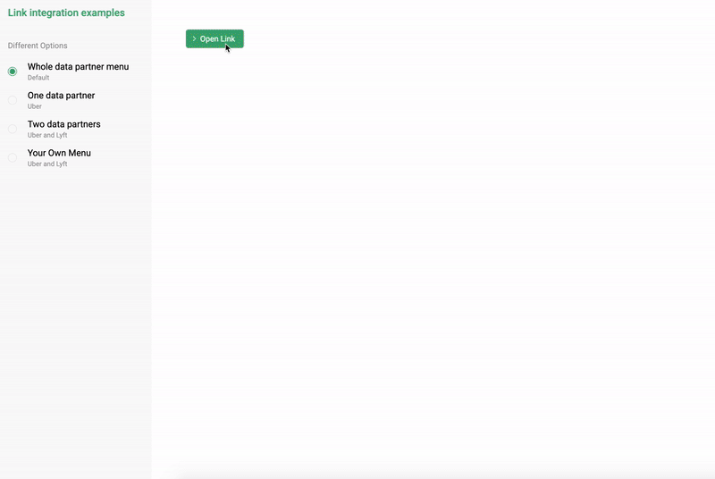
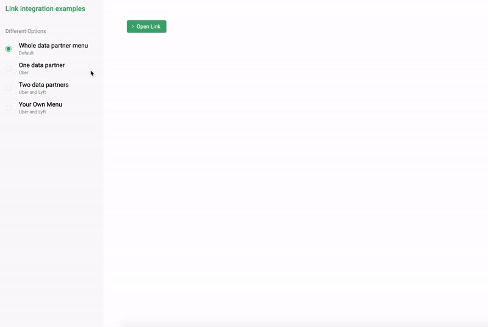
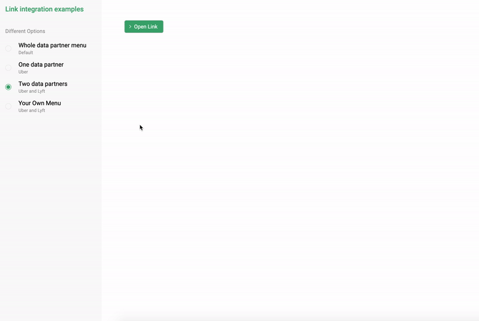

# Argyle Link Integration

[Argyle Link](https://argyle.io/docs/argyle-link/overview) is a front-end UI element that allows your users to grant your application access to their workforce accounts. This example shows a simple way to integrate the link inside HTML file in different possible ways.

---

## Link Options :crystal_ball:

Switching between different options menu resets the `userToken` for the plugin. If you connect multiple partners staying in one of menu items, the `userToken` is saved and reused for the plugin ensuring all accounts are connected for the same user and the same state is retained.

### 1. Whole data partner menu

Opens the Link without provided any data partners - shows menu of all available data partners.

```js
Argyle.create({
  pluginKey: "your_plugin_key",
  dataPartners: [],
  //userToken: "user_token",
});
```

<br>

<details open><summary>:globe_with_meridians: Whole data partner menu demo </summary>
<br>
  <p align="center">
    
  </p>
</details>

### 2. One data partner

Providing only one data partner Link displays immediately the sign in screen for this data partner not showing the list menu of partners.

```js
Argyle.create({
  pluginKey: "your_plugin_key",
  dataPartners: ["uber"],
  //userToken: "user_token",
});
```

<br>

<details open><summary>:wolf: One data partner demo</summary>
<br>
  <p align="center">
    
  </p>
</details>

### 3. Two data partners

When two data partners are provided to the Link it displays menu of the data partners that has been provided, not displaying any other partners.

```js
Argyle.create({
  pluginKey: "your_plugin_key",
  dataPartners: ["uber", "lyft"],
  //userToken: "user_token",
});
```

<br>

<details open><summary>:cherries: Two data partners demo</summary>
<br>
  <p align="center">
    
  </p>
</details>

### 4. Your own menu

Example how to open multiple Link instances, for example if you want to provide two data partners but not show the list menu of them - here we provide two seperate button where each opens its own data partner individual sign in form.

```js
const initArgyle = (providedDataPartners) => {
  return Argyle.create({
    pluginKey: "your_plugin_key",
    dataPartners: providedDataPartners,
    //userToken: "user_token",
  });
};
```

<br>

<details open><summary>:pizza: Your own menu demo</summary>
<br>
  <p align="center">
    
  </p>
</details>
